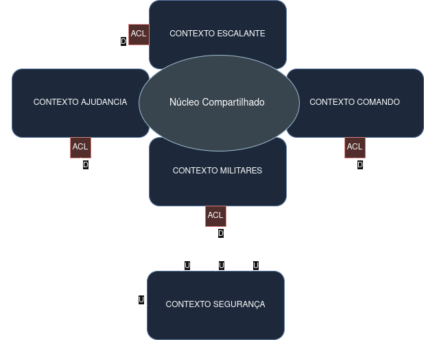
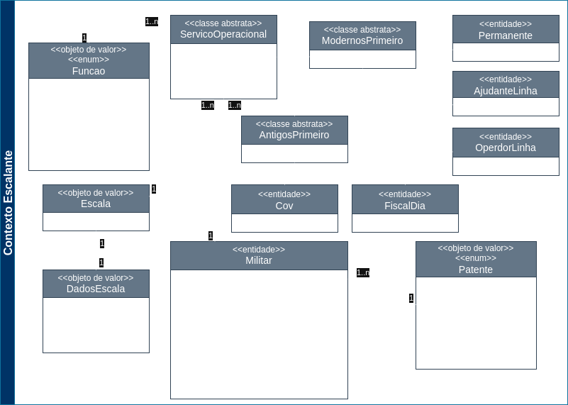
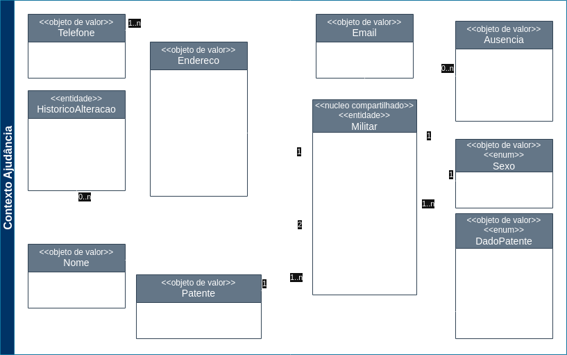
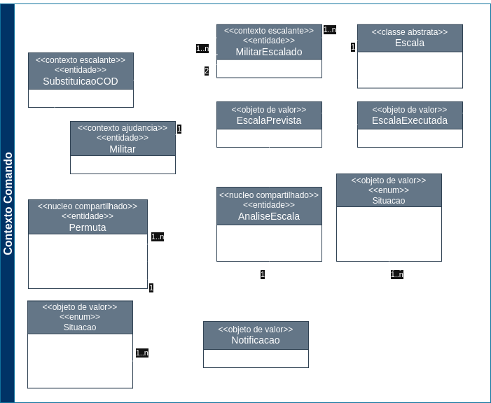
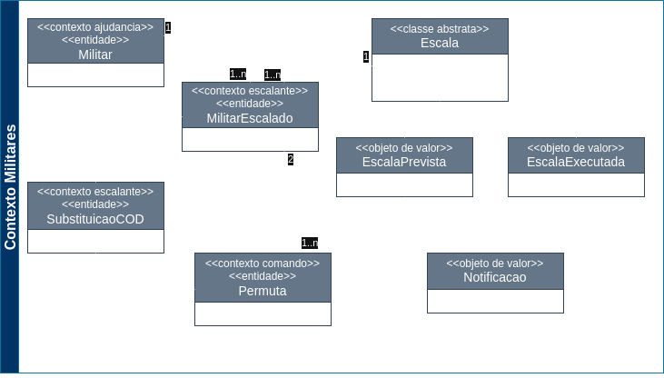

## Modelo do Projeto Escalante

### Descrição do Modelo

A solução proposta é um sistema web que permitirá otimizar todo o processo de elaboração das escalas de serviço operacional do quartel do CBMCE de Limoeiro do Norte, automatizando as partes mais dispendiosas da criação da escala, simplificando as etapas de analise e aprovação do comando, a solicitação e autorização de permutas e publicação da escala aprovada.

### Contextos Delimitados

Os contextos delimitados para o projeto estão alinhados com os subdomínios identificados no domínio do projeto, conforme o Mapa de Contexto abaixo:

### Diagrama de Contexto

O diagrama de contexto do projeto é representado pelo diagrama abaixo:

### Diagramas UML

Os diagramas abaixo representam as classes do sistema e suas relações:

Obs¹: Os agregados estão representados pelas classes envoltas por linhas pontilhadas. As classes que não estão envolvidas por estas linhas representam agregados separados.

Obs²: As classes que possuirem o indicativo `<<nucleo compartilhado>>` são classes que serão compartilhadas entre os contextos do sistema. As que possuirem o indicativo `<<nome contexto>>` estão utilizando o nucleo compartilhado de outro contexto do sistema. 

 

 

 

